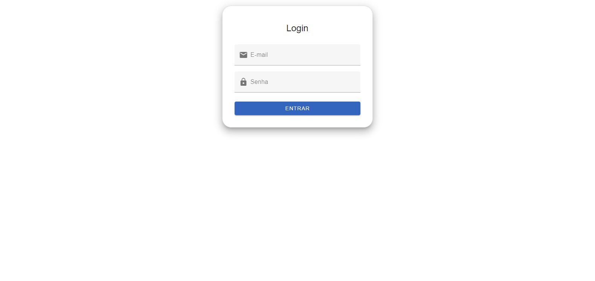
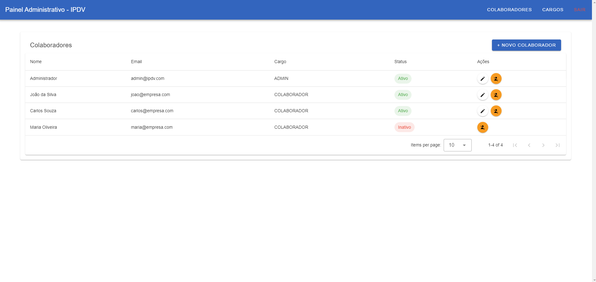
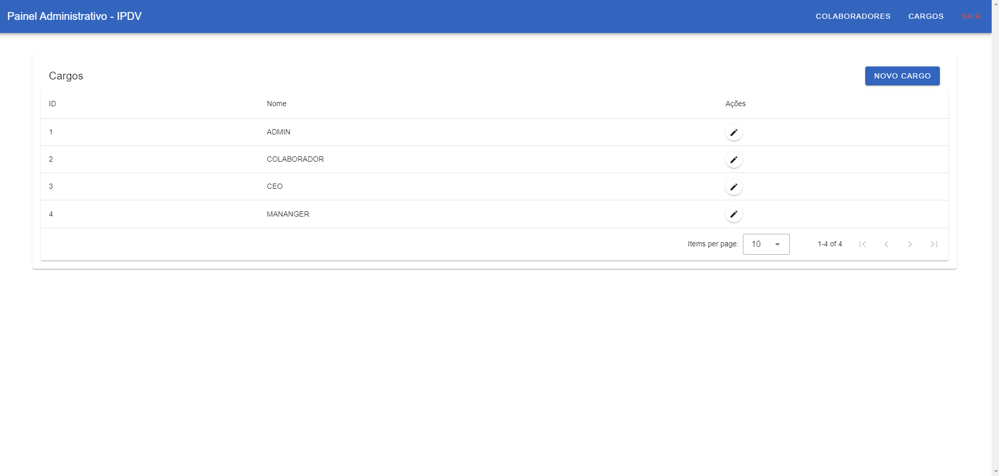

# Sistema de Gerenciamento de Colaboradores - IPDV

Este projeto consiste em uma aplicação fullstack para gerenciamento de colaboradores e cargos, desenvolvida como parte de um desafio técnico solicitado pela IPDV.

## 🧠 Visão Geral

A aplicação permite:
- Autenticação de usuários (login com JWT)
- Listagem de colaboradores
- Cadastro, edição e desativação de colaboradores
- Listagem e gerenciamento de cargos
- Interface amigável com design moderno utilizando Vuetify

---

## 🛠️ Tecnologias Utilizadas

### ✅ Backend
- **Node.js**
- **Express**
- **TypeORM**
- **JWT (JSON Web Token)**
- **PostgreSQL**
- **Docker / Docker Compose**

### ✅ Frontend
- **Vue 3** (Composition API)
- **Vuetify 3**
- **Vite**
- **Axios**

---

## 🚀 Execução do Projeto

### Pré-requisitos
- Docker e Docker Compose instalados

### Subindo o ambiente
Na raiz do projeto, execute:

```bash
docker compose up --build
```
Isso irá:
- Subir o banco PostgreSQL
- Rodar as migrations automaticamente
- Rodar o backend em http://localhost:3000
- Disponibilizar o frontend em http://localhost:5173

---

## 📂 Estrutura do Projeto
  
```
.
├── backend
│   ├── src
│   │   ├── controllers
│   │   ├── services
│   │   ├── middlewares
│   │   ├── routes
│   │   └── database (migrations, entities)
│   └── Dockerfile
├── frontend
│   ├── src
│   │   ├── views
│   │   ├── components
│   │   └── userModal
│   └── Dockerfile
├── docker-compose.yml
└── README.md
```

---

## 📸 Imagens da Aplicação

### 🔐 Tela de Login


### 👥 Listagem de Colaboradores


### 🧑‍💼 Gerenciamento de Cargos


## ✅ Funcionalidades Implementadas

- Login de usuários com proteção por token
- Tela protegida para listar colaboradores
- Modal para criação e edição de colaboradores
- Desativação de colaboradores (sem exclusão permanente)
- Tela para listagem e edição de cargos
- Barra de navegação entre seções
- Integração completa via Docker Compose

---

## 📌 Considerações Finais

Este projeto foi desenvolvido com foco em boas práticas de arquitetura, separação de responsabilidades e experiência do usuário. A stack foi definida de acordo com o solicitado:

✔️ Node.js + Express  
✔️ PostgreSQL  
✔️ Vue.js + Vuetify  
✔️ Docker para orquestração dos serviços

---

## ✍️ Autor

Desenvolvido por **Edvan Junior** para o processo seletivo da **IPDV**.
